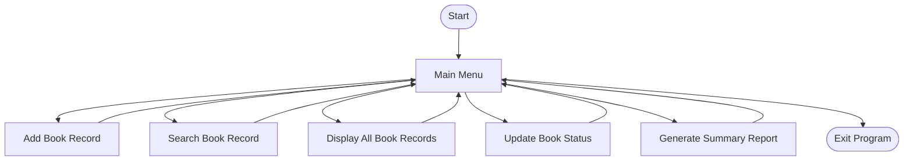

# Library Check-In / Check-Out System Flowchart

```mermaid
flowchart TD
    A([Start]) --> B[Main Menu]
    B --> C[Add Book Record]
    B --> D[Search Book Record]
    B --> E[Display All Book Records]
    B --> F[Update Book Status]
    B --> G[Generate Summary Report]
    B --> H([Exit Program])
    C --> B
    D --> B
    E --> B
    F --> B
    G --> B
```

